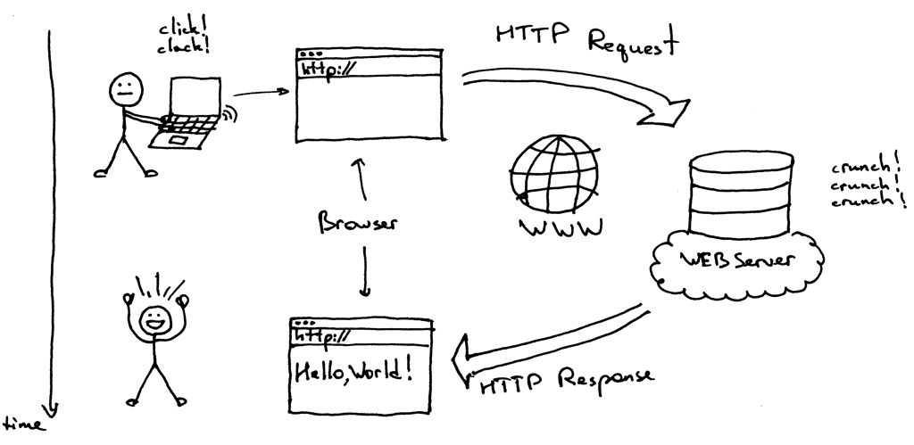
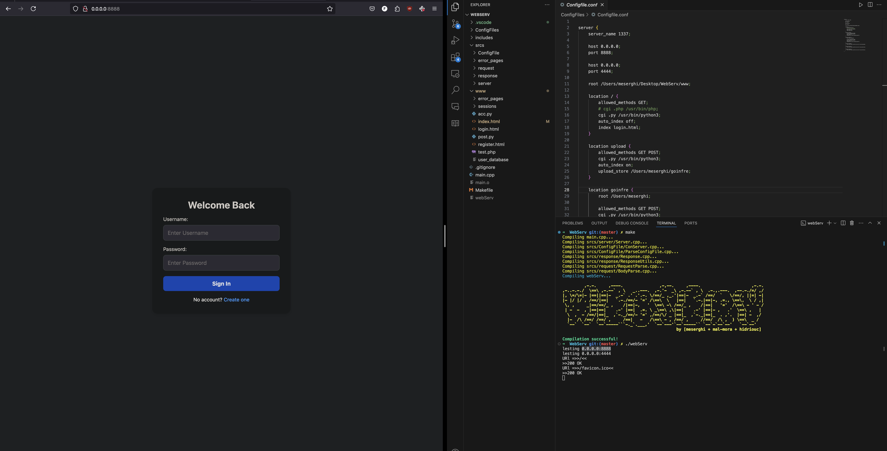
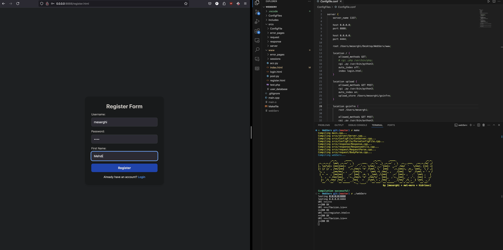
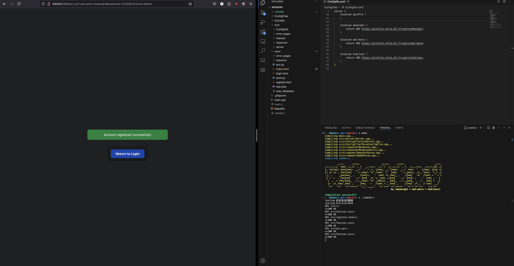
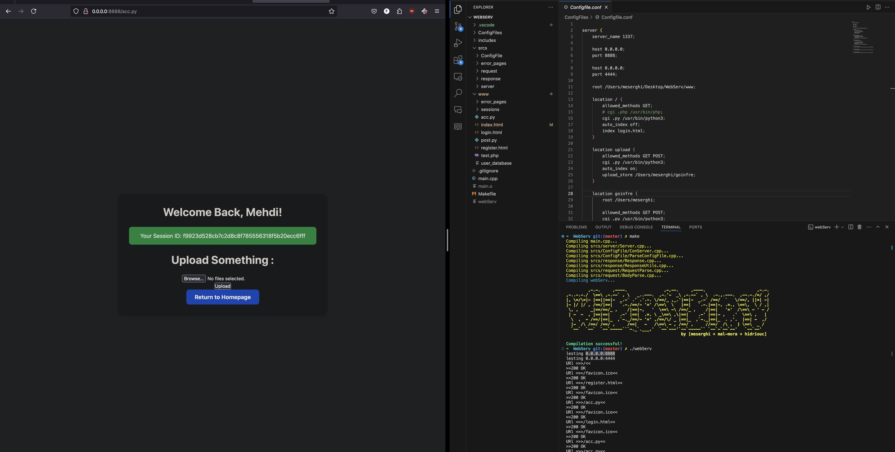
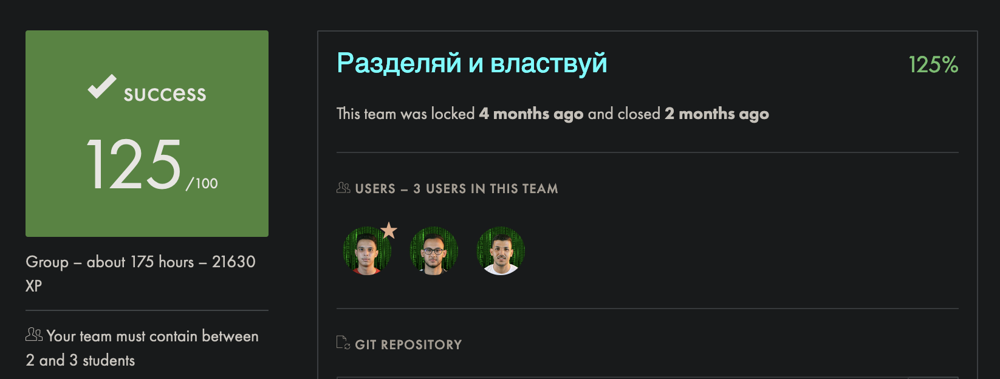

# 🚀 WebServ - Your Lightweight HTTP Server

<div align="center">
  

  ### *Power and simplicity in one elegant package*
  
  [](https://opensource.org/licenses/MIT)
  [](https://isocpp.org/)
  []()
</div>

## ✨ Welcome to WebServ

**WebServ** is not just another HTTP server — it’s a deep dive into the heart of web protocols, meticulously handcrafted in **C++98**.  
Built from scratch, this lightweight yet powerful server delivers everything from static websites to dynamic web applications with efficiency and elegance.

---

## 🔍 Project Overview

<div align="center">
  
</div>

WebServ implements the **HTTP/1.1** protocol, mimicking behavior from industry giants like **Nginx** and **Apache**, with a strong focus on **simplicity**, **education**, and **clean architecture**.

Key highlights:
- Fully modular, **SOLID principles**-driven design
- Event-driven server (using `select()`)
- Multi-server hosting
- Authentication systems with **session cookies**
- File uploads/downloads
- Dynamic content execution via **CGI** (**PHP + Python**)

---

## 📋 Table of Contents
- [✨ Features](#-features)
- [🧩 Architecture](#-architecture)
- [🛠️ Technologies](#️-technologies)
- [⚙️ Installation](#️-installation)
- [📝 Configuration](#-configuration)
- [🚦 Usage](#-usage)
- [💪 Challenges & Solutions](#-challenges--solutions)
- [👨‍💻 The Dream Team](#-the-dream-team)
- [🔮 Future Enhancements](#-future-enhancements)
- [📄 License](#-license)

---

## ✨ Features

### 🌐 Core Capabilities
- **🔄 Multi-server hosting**: Listen on multiple ports, serve multiple roots
- **📊 Efficient non-blocking I/O**: Fast and scalable
- **🔒 Session management**: Secure authentication with **cookies**
- **📁 File operations**: Robust file upload and download system
- **⚡ Dynamic content**: **CGI support** for **PHP** and **Python**
- **🛡️ Access control**: Restrict allowed HTTP methods
- **📑 Directory listing**: Customizable auto-indexing
- **🔀 URL Redirection**: Easy redirects using HTTP 301/302

### 🚦 HTTP Protocol Support
- **GET**: 📥 Fetch resources
- **POST**: 📤 Submit data or upload files
- **DELETE**: 🗑️ Remove resources
- **Status Codes**: ✅ Full HTTP status code management (2xx, 3xx, 4xx, 5xx)
- **Cookies**: 🍪 Manage sessions and authentication securely

### 📦 Content Processing
- **🧩 MIME type handling**
- **📏 Content-Length validation**
- **🔄 Chunked transfer encoding**
- **📂 Multipart/form-data support**
- **🗂️ URL encoding and decoding**

---

## 🧩 Architecture

WebServ follows a clean **modular architecture** respecting **SOLID principles**:

- **Single Responsibility**: Each class does exactly one thing
- **Open/Closed**: Extend features without modifying existing code
- **Liskov Substitution**: Flexible interfaces
- **Interface Segregation**: No bloated dependencies
- **Dependency Inversion**: High-level and low-level modules decoupled

**Core Components**:
- **Event-driven Core**: Multiplexed I/O with `select()`
- **Request Parser**: Handles fragmented HTTP messages robustly
- **Response Builder**: Crafts perfect HTTP responses
- **Configuration Manager**: Validates and loads server settings
- **CGI Handler**: Runs **PHP** and **Python** scripts dynamically
- **Session Manager**: Login/session tracking with **cookies**
- **File Manager**: Secure static file serving and uploads

---

## 🛠️ Technologies

- **C++98**: All core logic
- **POSIX APIs**: Low-level system interaction
- **Socket Programming**: No external libraries
- **Python / PHP**: For dynamic CGI scripts
- **HTTP/1.1 Compliance**: Fully respect protocol specifications

---

## ⚙️ Installation

```bash
# Clone the repo
git clone https://github.com/Serghini04/WebServ.git

# Enter the directory
cd WebServ

# Build the project
make

# Run the server
./webserv
```

---

## 📸 Screenshots

<p align="center"><strong>1. Connect to localhost:8888 to see the Welcome page</strong></p>
<p align="center">
  
</p>

<p align="center"><strong>2. Register through the signup form</strong></p>
<p align="center">
  
</p>

<p align="center"><strong>3. Successfully registered</strong></p>
<p align="center">
  
</p>

<p align="center"><strong>4. Login using the registered credentials</strong></p>
<p align="center">
  
</p>

---

## 📝 Configuration

WebServ is fully configurable via a `.conf` file (`Configfile.conf`).

Example:

```conf
server {
    server_name 1337;
    host 0.0.0.0;
    port 8080;
    root /Users/serghini/Desktop/WebServ/www;

    location / {
        allowed_methods GET;
        cgi .php /usr/bin/php;
        cgi .py /usr/bin/python3;
        auto_index off;
        index index.html;
    }

    location /upload {
        allowed_methods GET POST;
        upload_store /Users/serghini/uploads;
        auto_index on;
    }

    location /mehdi {
        return 302 https://profile.intra.42.fr/users/mehdi;
    }
}
```

### ⚡ Key Options
- **server_name**: Friendly name for the server
- **host**: IP binding
- **port**: Listening port
- **root**: Default document root
- **location**: Fine-grained route handling
  - `allowed_methods`
  - `cgi` scripts
  - `auto_index`
  - `upload_store`
  - `return` for **redirections**

---

## 💪 Challenges & Solutions

### 🔥 Handling Event-driven I/O
**Solution**: Built a custom `select()`-based event loop.

### 🧩 C++98 Constraints
**Solution**: Developed custom data structures manually.

### ⚡ Robust HTTP Parsing
**Solution**: Built a finite-state machine parser to handle chunked, multipart, and large body parsing.

### 🧪 Secure CGI Handling
**Solution**: Isolated environment for safe PHP and Python execution.

### 📁 Efficient File Uploads
**Solution**: Streamed files directly to disk.

### 🔄 Full HTTP Status Management
**Solution**: Dynamically generated correct responses for every request outcome.

### 🍪 Cookie-based Sessions
**Solution**: Designed login systems based on HTTP cookies, managing secure authentication sessions.

### 🏗️ Dynamic Configuration Parsing
**Solution**: Built a resilient `.conf` parser from scratch.

---

## 👨‍💻 The Dream Team

<div align="center">
  
</div>

### 🧙‍♂️ Mehdi Serghini ([@Serghini04](https://github.com/Serghini04))
> *"The Request Whisperer"*

- 📥 HTTP request parsing
- 🔄 HTTP method implementation (GET, POST, DELETE)
- ✅ Full HTTP status code handling
- 🔐 Login system with **cookie-based sessions**
- 📦 Robust content handling (Content-Length, Chunked Transfer, Multipart Forms)
- ⚡ Dynamic CGI execution (PHP + Python)

### 🏗️ Mohammed Al Morabit ([@mal-mora](https://github.com/simorabit))
> *"The Architect"*

- 🏢 Server multi-instance management
- 📨 Response generation and formatting
- 🔌 Low-level socket handling
- 🔄 Event-driven core logic
- 🔀 Redirection management (301/302)

### 🧪 Hicham Driouch ([@hidriuoc](https://github.com/paybat))
> *"The Configuration Alchemist"*

- ⚙️ Configuration file parsing
- 🛣️ Routing and directory listing
- 🔄 CGI execution system

---

## 🔮 Future Enhancements

- 🔒 HTTPS (SSL/TLS) support
- 🚀 WebSocket server upgrades
- 🌐 Reverse proxy features
- 📊 Built-in logging and analytics
- 🧪 Full unit and integration testing
- 🛡️ DDoS protection with advanced rate limiting
- 🗄️ Static file caching

---

## 📄 License

This project is licensed under the **MIT License** — open-source, free, and ready to evolve!

<div align="center">
  
  
  ### Made with ❤️ and countless cups of ☕ by Mehdi Serghini & team
</div>
